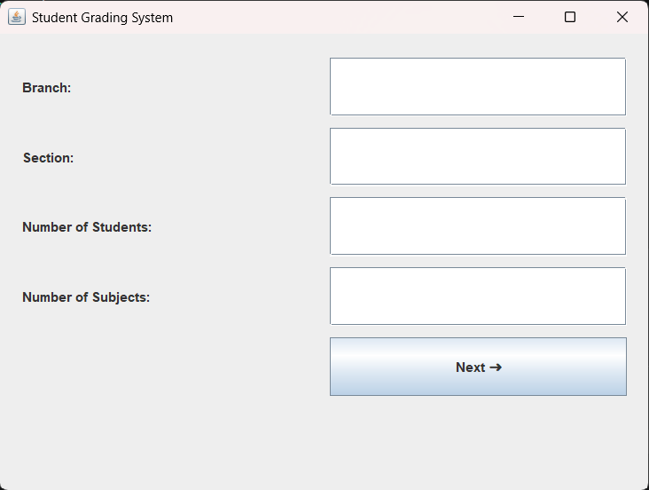
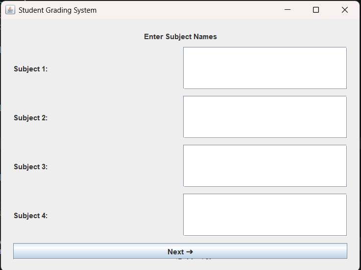
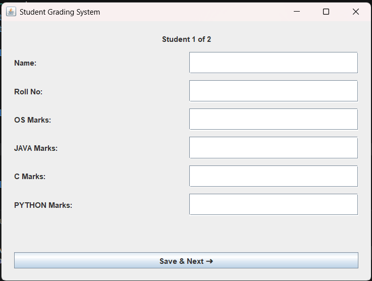
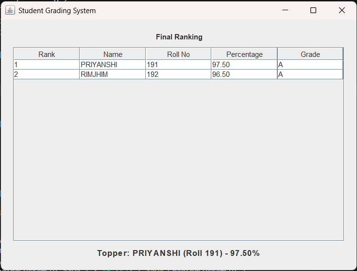

Since this is your **3rd Semester Java Project** and your repository contains:

* `GradingSystemGUI.java`
* `Screenshot1.png`
* `Screenshot2.png`
* `Screenshot3.png`
* `Screenshot4.png`

here is a professional `README.md` for GitHub:

# 🎓 Student Grading System GUI

## 📌 3rd Semester Java Project

A GUI-based **Student Grading System** developed using **Java Swing** as part of the **3rd Semester Java Programming course**. The application automates student result processing by calculating percentages, assigning grades, generating rankings, and identifying toppers through an interactive graphical interface.

---

## 🎯 Project Objectives

* Automate student result calculation.
* Eliminate manual grade computation.
* Provide an easy-to-use graphical interface.
* Rank students based on academic performance.
* Display topper information automatically.

---

## ✨ Features

✅ Branch and Section Management
✅ Dynamic Subject Creation
✅ Multiple Student Record Support
✅ Automatic Percentage Calculation
✅ Automatic Grade Assignment
✅ Student Ranking System
✅ Topper Identification
✅ Interactive GUI using Java Swing
✅ JTable-based Result Display
✅ Special Grading Rules for Honors Students

---

## 🛠 Technologies Used

* Java
* Java Swing
* AWT
* JTable
* Object-Oriented Programming (OOP)

---

## 📊 Grading Criteria

### Regular Students

| Percentage    | Grade |
| ------------- | ----- |
| 90% and above | A     |
| 75% - 89%     | B     |
| 60% - 74%     | C     |
| 40% - 59%     | D     |
| Below 40%     | F     |

### Honors Students

| Percentage    | Grade |
| ------------- | ----- |
| 95% and above | A     |
| 85% - 94%     | B     |
| 70% - 84%     | C     |
| 50% - 69%     | D     |
| Below 50%     | F     |

---

## 🖼 Project Screenshots

### Home Screen



### Subject Entry Screen



### Student Marks Entry Screen



### Final Ranking and Result Screen



---

## 📂 Repository Structure

```text
Student-Grading-System-GUI/
│
├── GradingSystemGUI.java
├── Screenshot1.png
├── Screenshot2.png
├── Screenshot3.png
├── Screenshot4.png
└── README.md
```

---

## 🚀 How to Run

### Compile the program

```bash
javac GradingSystemGUI.java
```

### Run the application

```bash
java GradingSystemGUI
```

---

## 📚 Concepts Used

* Classes and Objects
* Inheritance
* Method Overriding
* Arrays
* Sorting
* Event Handling
* GUI Programming
* Polymorphism
* Encapsulation

---

## 🎓 Academic Information

**Course:** Java Programming
**Semester:** 3rd Semester
**Project Type:** Mini Project

---

## 👩‍💻 Author

**Priyanshi Gupta**
B.Tech CSE (Data Science)
Noida Institute of Engineering and Technology (NIET)

---

⭐ If you found this project useful, consider giving it a star on GitHub!

This README will make your repository look professional and suitable for semester submissions, internships, and portfolio projects.
